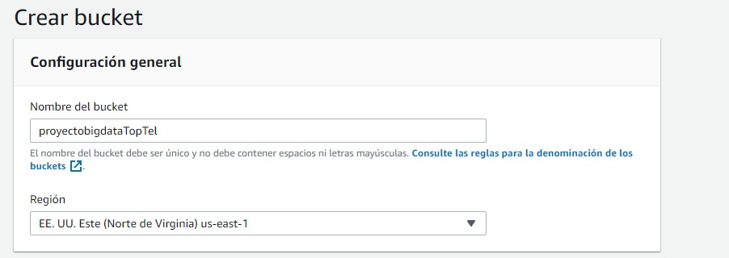
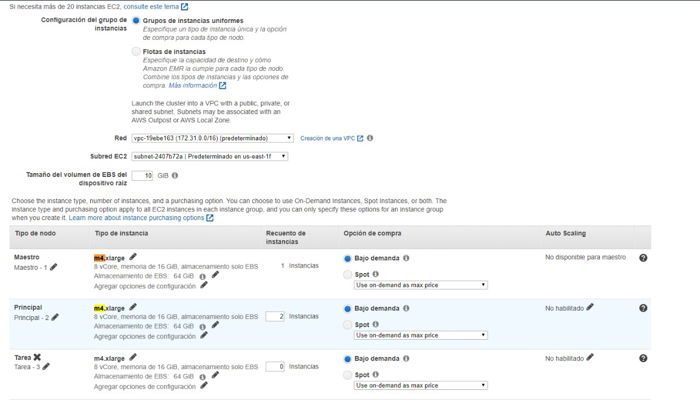
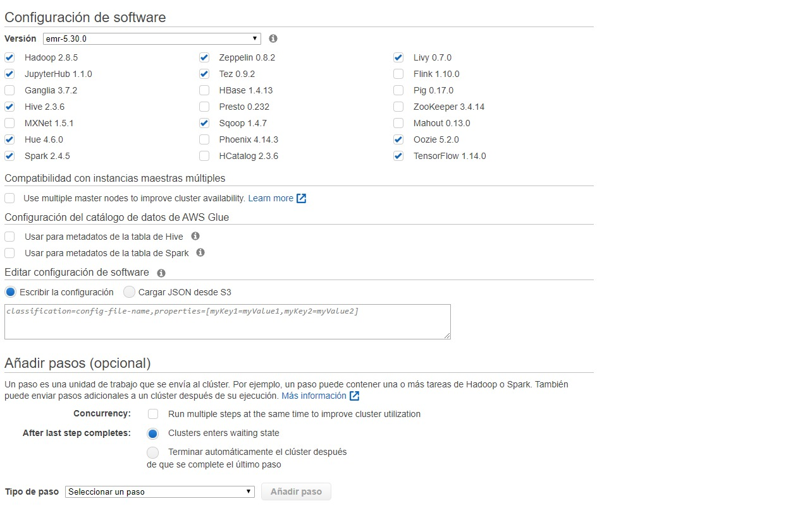
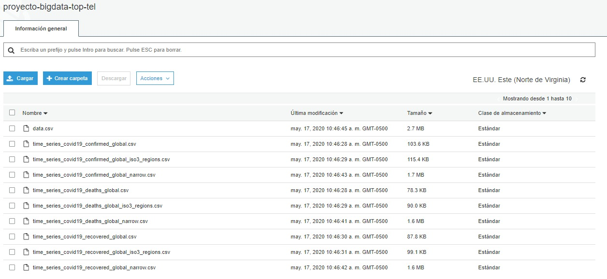

# st0263_P3
Análisis exploratorio de datos sobre datasets de COVID-19 usando Spark.

  1. Creación del bucket y cluster usando Amazon S3 y EMR.

Para poder trabajar inicialmente tenemos que crear un bucket y un cluster de datos, con estas herramientas podremos luego almacenar y analizar los datos de los datasets del COVID-19.
Bucket:

Cluster

  2. Ingesta de datos.

Descargamos los datos referentes al COVID-19 en https://data.humdata.org/dataset/novel-coronavirus-2019-ncov-cases, https://data.humdata.org/dataset/positive-cases-of-covid-19-in-colombia y https://data.humdata.org/ https://www.ins.gov.co/Paginas/Inicio.aspx https://www.who.int/data/gho. Posteriormente los agregamos a nuestro datalake en S3.

